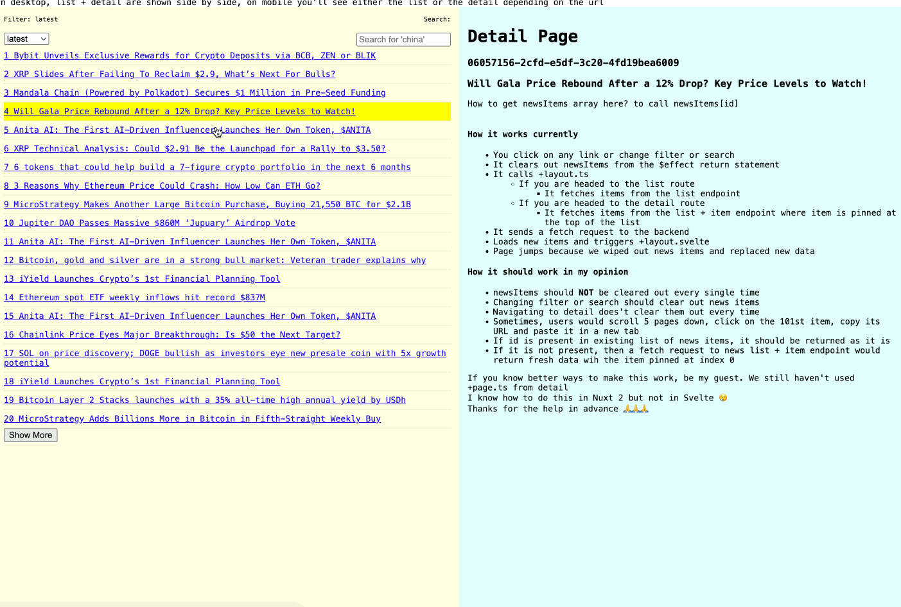
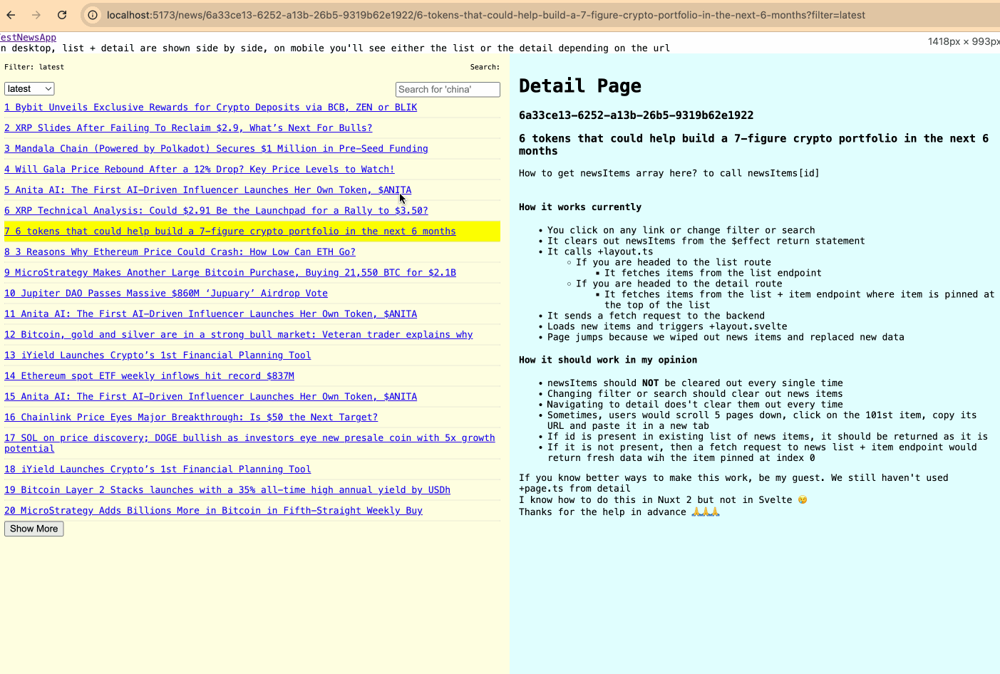
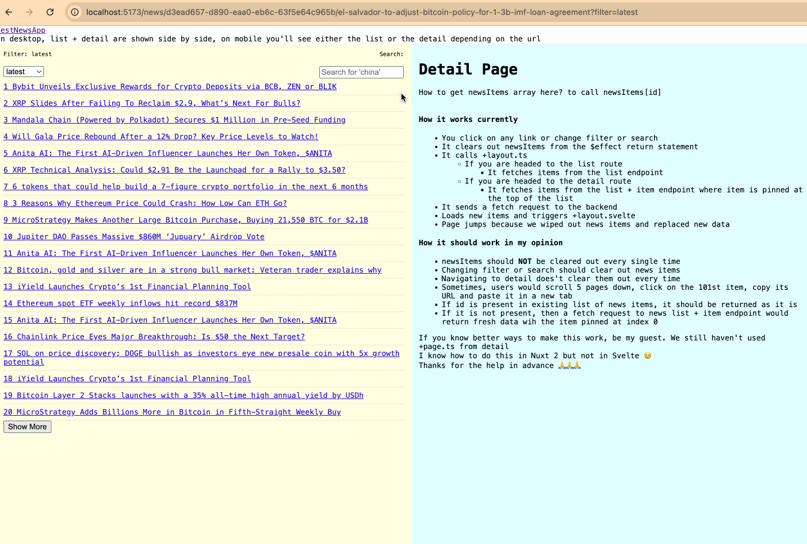

# sv

- This repo illustrates one basic issue. 
- After running this on the browser, click on any item from page 1 and it works, scroll to page 2 and click on an item and the app breaks. 
- This happens because we are losing data every time we call +layout.ts. 
- There has to be some way to store data as long as the filter or search hasn't changed. Sometimes users might type a url directly for an item and that also needs to work. Any ideas?

## Clicking item on any page other than the first page under any filter or search breaks the app

## Type url of an item from page 1 and it works

## Type url of an item from any other page and it breaks

## I am not sure how to do this in sveltekit but here's my 10 cents

- It somehow needs to retain news items without clearing them everytime on +layout.ts
- If id exists in news items it renders the id directly without doing fetch requests
- If id does not exist, it will load the item and then return it
- News items are cleared only when filter or search changes
